# Familiarization with Sensors, Actuators, and Embedded Systems


# Objectives

After completing this experiment, students will be able to:

- Understand the concept of Embedded Systems used in IoT.
- Study the architecture of Embedded Systems.
- Understand the role of Microcontrollers in IoT.
- Familiarize themselves with Raspberry Pi, ESP32, ESP8266, and Arduino Uno.
- Learn the GPIO pin configuration of different development boards.
- Understand their specifications and applications.
- Compare different embedded development boards.

---

# Background Theory

## Internet of Things (IoT)

The **Internet of Things (IoT)** refers to a network of interconnected physical devices capable of sensing, collecting, processing, and exchanging data over the Internet. These devices contain embedded processors, sensors, actuators, communication modules, and software that enable them to operate intelligently with minimal human intervention.

IoT enables real-time monitoring, automation, remote control, and intelligent decision-making across various industries.

### Applications of IoT

- Smart Homes
- Smart Agriculture
- Healthcare Monitoring
- Industrial Automation
- Environmental Monitoring
- Smart Transportation
- Smart Cities
- Energy Management
- Robotics
- Security Systems

---

## Embedded Systems

An **Embedded System** is a dedicated computer system designed to perform one or more specific tasks within a larger system. Unlike personal computers, embedded systems execute predefined functions continuously and efficiently.

They are designed for:

- High reliability
- Low power consumption
- Fast response
- Real-time operation
- Compact size
- Cost-effectiveness

Every IoT device contains an embedded system that collects data from sensors, processes it, communicates with cloud services, and controls actuators.

---

## Components of an Embedded System

### Processor

Acts as the brain of the system.

Examples:

- ESP32
- ESP8266
- Arduino ATmega328P
- Raspberry Pi ARM Processor

---

### Memory

Stores programs and temporary data.

Types include:

- Flash Memory
- SRAM
- EEPROM
- SD Card Storage

---

### Input Devices

Collect physical information.

Examples:

- Temperature Sensor
- Humidity Sensor
- Light Sensor
- Gas Sensor
- Soil Moisture Sensor

---

### Output Devices

Perform physical actions.

Examples:

- LEDs
- Motors
- Relays
- Buzzers
- LCD Displays

---

### Communication Module

Allows devices to exchange information.

Protocols include:

- Wi-Fi
- Bluetooth
- ZigBee
- LoRa
- GSM
- MQTT
- HTTP

---

# Embedded Systems Architecture

```text
                      +----------------------+
                      |     Cloud Server     |
                      | Database / Analytics |
                      +----------▲-----------+
                                 |
                           Internet/Wi-Fi
                                 |
                      +----------▼-----------+
                      | Communication Module |
                      | Wi-Fi / Bluetooth    |
                      +----------▲-----------+
                                 |
                      +----------▼-----------+
                      | Microcontroller/CPU  |
                      | ESP32 / Arduino etc. |
                      +----------▲-----------+
                                 |
             +-------------------+------------------+
             |                                      |
      +------▼------+                      +--------▼-------+
      |   Sensors   |                      |   Actuators    |
      +-------------+                      +----------------+
```

---

# Microcontrollers for IoT

Microcontrollers are integrated circuits containing a processor, memory, and programmable input/output peripherals on a single chip. They are widely used in IoT because they are inexpensive, energy efficient, and capable of real-time control.

---

# Raspberry Pi

## Image

<p align="center">
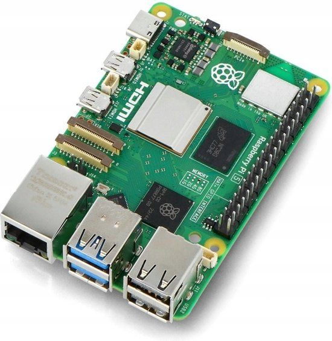
</p>

---

## GPIO Pin Configuration

<p align="center">
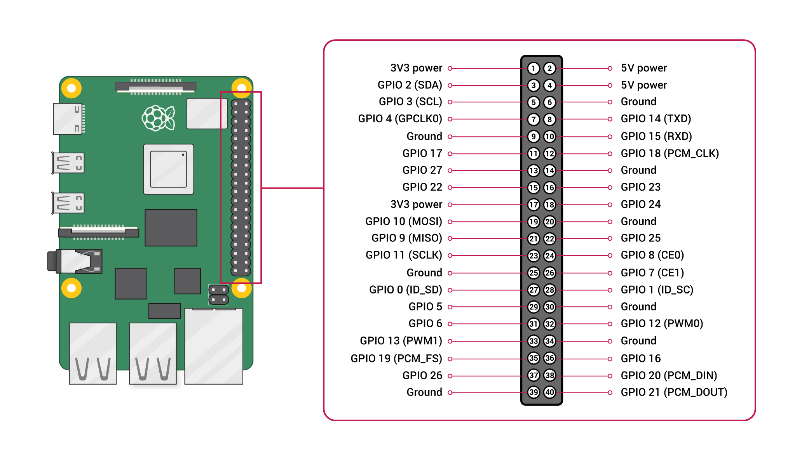
</p>

---

## Background Theory

The Raspberry Pi is a **Single Board Computer (SBC)** developed by the Raspberry Pi Foundation. Unlike microcontrollers, it runs a complete Linux operating system, making it capable of multitasking, networking, multimedia processing, artificial intelligence, and edge computing.

It is commonly used as an IoT gateway because it can communicate with multiple microcontrollers while processing large amounts of data.

---

## Features

- 64-bit ARM Processor
- Linux Operating System
- Built-in Wi-Fi
- Bluetooth
- Ethernet Port
- USB Ports
- HDMI Output
- CSI Camera Interface
- DSI Display Interface
- 40 GPIO Pins

---

## Specifications

| Feature | Specification |
|----------|--------------|
| Processor | Quad-Core ARM Cortex |
| RAM | 1GB–8GB |
| GPIO Pins | 40 |
| Operating Voltage | 5V |
| USB Ports | 4 |
| HDMI | Yes |
| Wi-Fi | Yes |
| Bluetooth | Yes |

---

## Working Principle

When power is supplied, the Raspberry Pi loads its operating system from the microSD card into RAM. The Linux kernel initializes the processor and peripheral devices.

Applications running on Linux interact with GPIO pins to read data from sensors and control actuators. Data can also be transmitted to cloud servers through Wi-Fi or Ethernet for remote monitoring and automation.

The processing sequence is:

1. Boot operating system.
2. Initialize GPIO pins.
3. Read sensor inputs.
4. Process data.
5. Connect to cloud.
6. Send or receive data.
7. Control actuators.

---

# ESP32

## Image

<p align="center">

</p>

---

## Pin Configuration

<p align="center">
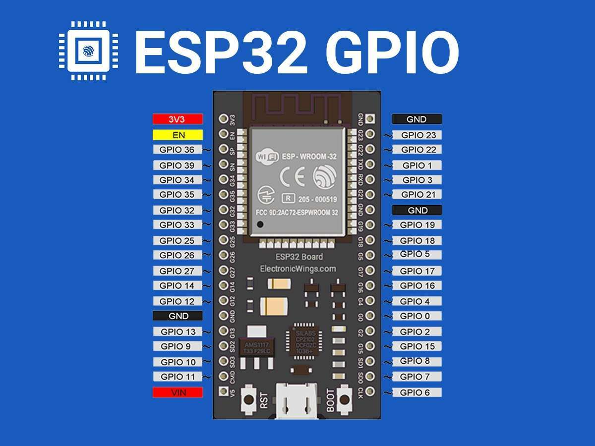
</p>

---

## Background Theory

ESP32 is a high-performance, low-power microcontroller developed by Espressif Systems. It integrates Wi-Fi and Bluetooth connectivity on a single chip, making it ideal for IoT applications.

Its dual-core processor allows simultaneous execution of communication and processing tasks while consuming very little power.

---

## Features

- Dual-Core Processor
- Wi-Fi
- Bluetooth
- ADC
- DAC
- PWM
- Touch Sensor
- SPI
- UART
- I2C
- Deep Sleep Mode

---

## Specifications

| Feature | Specification |
|----------|--------------|
| CPU | Dual-Core Xtensa LX6 |
| Clock Speed | Up to 240 MHz |
| Flash Memory | 4 MB |
| GPIO Pins | 34 |
| ADC Channels | 18 |
| DAC Channels | 2 |
| Operating Voltage | 3.3V |

---

## Working Principle

The ESP32 boots from internal flash memory and executes firmware stored in the chip.

It continuously reads sensor data through GPIO pins, processes the information using the CPU, and communicates with cloud servers through Wi-Fi or Bluetooth.

Its deep-sleep feature allows battery-powered devices to operate for extended periods by minimizing power consumption.

---

# ESP8266

## Image

<p align="center">
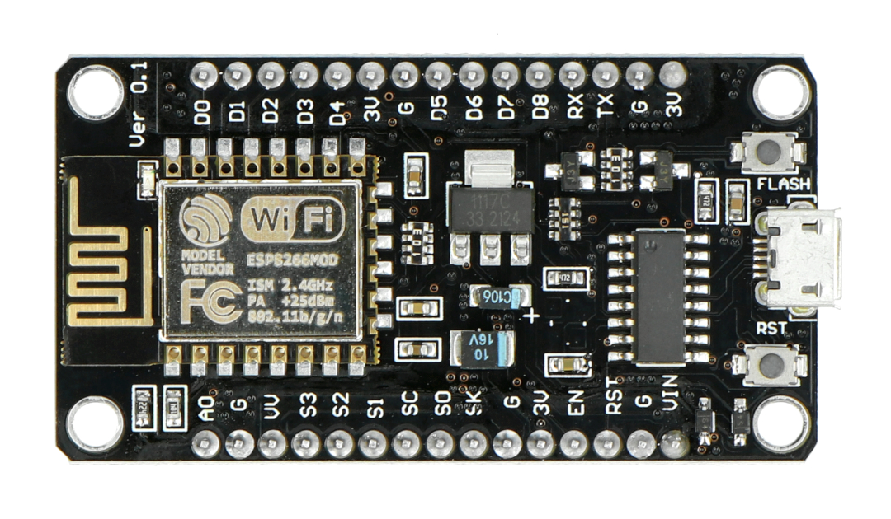
</p>

---

## Pin Configuration

<p align="center">
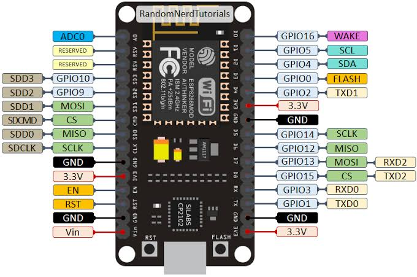
</p>

---

## Background Theory

ESP8266 is a compact and low-cost Wi-Fi-enabled microcontroller developed by Espressif Systems. It made IoT affordable by integrating a TCP/IP networking stack and Wi-Fi functionality into a single chip.

Although it has fewer GPIO pins than the ESP32, it remains popular for small wireless projects due to its simplicity and low cost.

---

## Features

- Built-in Wi-Fi
- Low Power Consumption
- Compact Design
- PWM
- UART
- SPI
- I2C Support
- ADC

---

## Specifications

| Feature | Specification |
|----------|--------------|
| CPU | Tensilica L106 |
| Flash | 4 MB |
| GPIO Pins | 17 |
| ADC | 1 Channel |
| Operating Voltage | 3.3V |
| Wi-Fi | IEEE 802.11 b/g/n |

---

## Working Principle

After power-up, the ESP8266 loads firmware from flash memory and initializes the Wi-Fi module.

The firmware repeatedly performs the following tasks:

- Reads sensor data
- Processes data
- Connects to a Wi-Fi network
- Sends information to the cloud
- Receives remote commands
- Controls output devices

---

# Arduino Uno

## Image

<p align="center">
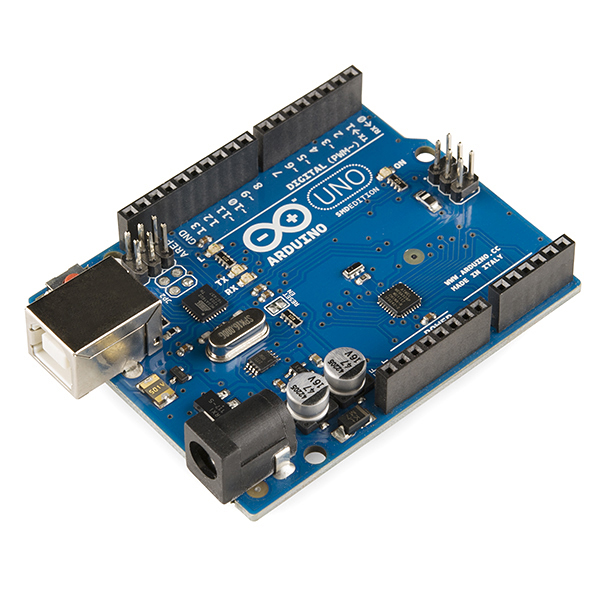
</p>

---

## Pin Configuration

<p align="center">
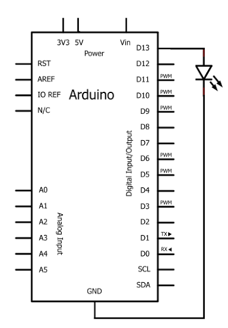
</p>

---

## Background Theory

Arduino Uno is an open-source microcontroller development board based on the ATmega328P microcontroller. Unlike Raspberry Pi, it does not run an operating system. Instead, it executes a single compiled program (called a sketch) stored in flash memory.

Arduino Uno is widely used for education, robotics, sensor interfacing, automation, and rapid prototyping due to its simplicity and extensive community support.

---

## Features

- ATmega328P Microcontroller
- 14 Digital I/O Pins
- 6 Analog Input Pins
- PWM Support
- USB Programming
- UART
- SPI
- I2C
- Open-Source Hardware

---

## Specifications

| Feature | Specification |
|----------|--------------|
| Microcontroller | ATmega328P |
| Clock Speed | 16 MHz |
| Flash Memory | 32 KB |
| SRAM | 2 KB |
| EEPROM | 1 KB |
| Digital Pins | 14 |
| Analog Pins | 6 |
| Operating Voltage | 5V |

---
---

# Sensors

Sensors are electronic devices that detect changes in the physical environment and convert them into electrical signals that can be interpreted by a microcontroller or computer. They are the primary input devices in an IoT system, enabling the collection of real-time data from the surrounding environment.

## Importance of Sensors in IoT

Sensors are essential components of IoT because they:

- Collect real-time environmental data.
- Monitor physical conditions continuously.
- Enable automation and intelligent decision-making.
- Improve efficiency and accuracy.
- Reduce human intervention.
- Provide data for cloud analytics and machine learning.

The basic operation of a sensor in an IoT system is shown below.

```text
Physical Quantity
 (Temperature, Light,
  Distance, Gas, etc.)
          │
          ▼
+-------------------+
|      Sensor       |
+-------------------+
          │
Electrical Signal
          │
          ▼
+-------------------+
| Microcontroller   |
| ESP32 / Arduino   |
+-------------------+
          │
          ▼
 Cloud / Display /
   Actuator
```

---

# 1. DHT11 / DHT22 Temperature and Humidity Sensor

## Image

<p align="center">
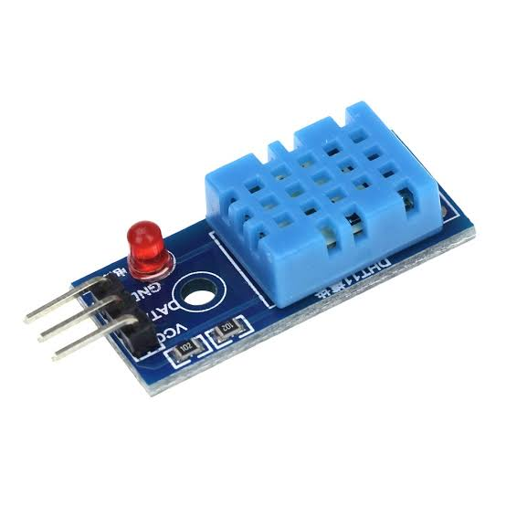
</p>

---

## Pin Configuration

<p align="center">
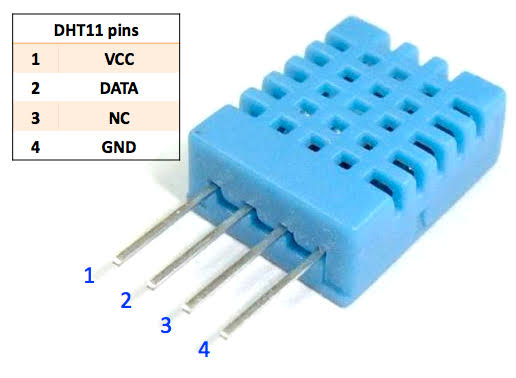
</p>

| Pin | Description |
|------|-------------|
| VCC | Power Supply (3.3V–5V) |
| DATA | Digital Data Output |
| NC | Not Connected (DHT11) |
| GND | Ground |

---

## Background Theory

The DHT11 and DHT22 are digital sensors used to measure **temperature** and **relative humidity**. They integrate a capacitive humidity sensor, an NTC thermistor, and an internal microcontroller that converts analog measurements into calibrated digital signals.

The DHT22 offers higher accuracy and a wider operating range than the DHT11, making it suitable for more demanding environmental monitoring applications.

### Applications

- Weather Stations
- Smart Homes
- Greenhouses
- HVAC Systems
- Environmental Monitoring
- Agriculture

---

## Features

- Measures Temperature
- Measures Humidity
- Digital Output
- Single-Wire Communication
- Factory Calibrated
- Easy to Interface

---

## Specifications

| Feature | DHT11 | DHT22 |
|----------|--------|---------|
| Temperature Range | 0°C to 50°C | -40°C to 80°C |
| Humidity Range | 20–90% RH | 0–100% RH |
| Accuracy | ±2°C | ±0.5°C |
| Operating Voltage | 3.3–5V | 3.3–6V |

---

## Working Principle

The DHT sensor contains two sensing elements:

- A **capacitive humidity sensor** measures moisture by detecting changes in capacitance.
- An **NTC thermistor** measures temperature by changing resistance with temperature.

The internal microcontroller converts these analog values into calibrated digital data and transmits the readings through a single data pin using a proprietary communication protocol.

The operational sequence is:

1. Power is applied.
2. Internal sensing elements measure humidity and temperature.
3. Analog signals are converted into digital values.
4. The data is transmitted to the microcontroller through the DATA pin.

---

# 2. Light Sensor (LDR)

## Image

<p align="center">
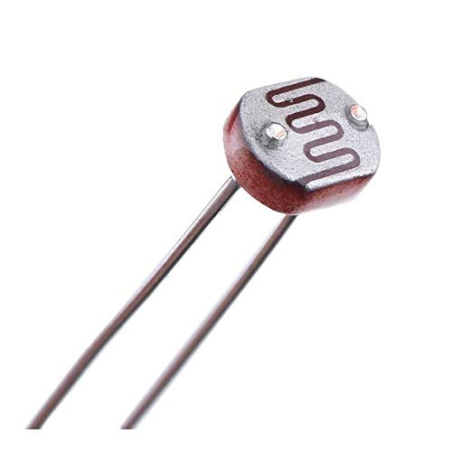
</p>

---

## Pin Configuration

<p align="center">
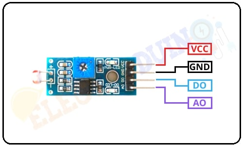
</p>

| Pin | Description |
|------|-------------|
| VCC | Supply Voltage |
| GND | Ground |
| AO | Analog Output |
| DO | Digital Output |

---

## Background Theory

A Light Dependent Resistor (LDR), also known as a photoresistor, is a passive sensor whose resistance varies according to the intensity of incident light. It is commonly used to detect ambient light levels.

### Applications

- Automatic Street Lights
- Smart Lighting Systems
- Solar Trackers
- Camera Exposure Control
- Security Systems

---

## Features

- Low Cost
- High Sensitivity
- Analog Output
- Digital Output (Module Version)
- Easy to Interface

---

## Working Principle

The sensing element is made of cadmium sulfide (CdS).

- In darkness, the resistance is very high.
- Under bright light, the resistance decreases significantly.

The changing resistance forms a voltage divider circuit, producing different output voltages that can be read by the analog input of a microcontroller.

---

# 3. Soil Moisture Sensor

## Image

<p align="center">
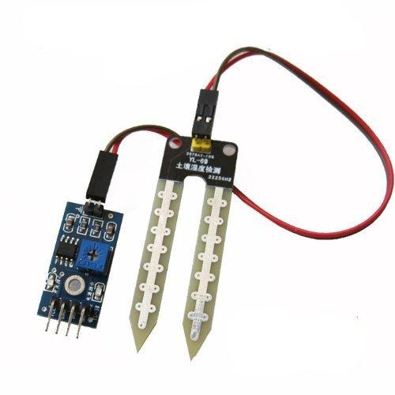
</p>

---

## Pin Configuration

<p align="center">
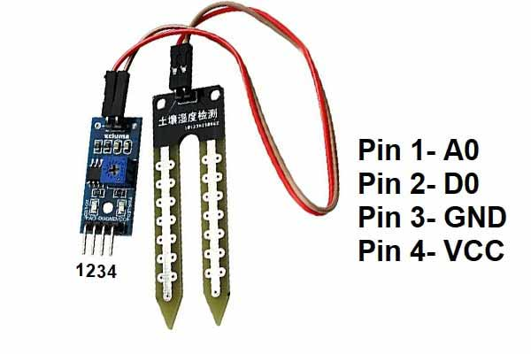
</p>

| Pin | Description |
|------|-------------|
| VCC | Supply Voltage |
| GND | Ground |
| AO | Analog Output |
| DO | Digital Output |

---

## Background Theory

The Soil Moisture Sensor measures the amount of water present in soil by detecting its electrical conductivity. Wet soil conducts electricity better than dry soil because water contains dissolved ions.

These sensors are widely used in automated irrigation and precision agriculture.

### Applications

- Smart Irrigation
- Agriculture
- Greenhouses
- Plant Monitoring
- Smart Farming

---

## Features

- Analog Output
- Digital Output
- Adjustable Threshold
- Easy Calibration
- Low Power Consumption

---

## Working Principle

The sensor contains two exposed probes that are inserted into the soil.

When voltage is applied:

- Wet soil allows more current to flow.
- Dry soil offers higher resistance.
- The output voltage changes according to moisture content.
- The microcontroller converts the analog voltage into moisture percentage.

Digital output can also trigger irrigation systems when the moisture level falls below a preset threshold.

---

# 4. Ultrasonic Sensor (HC-SR04)

## Image

<p align="center">
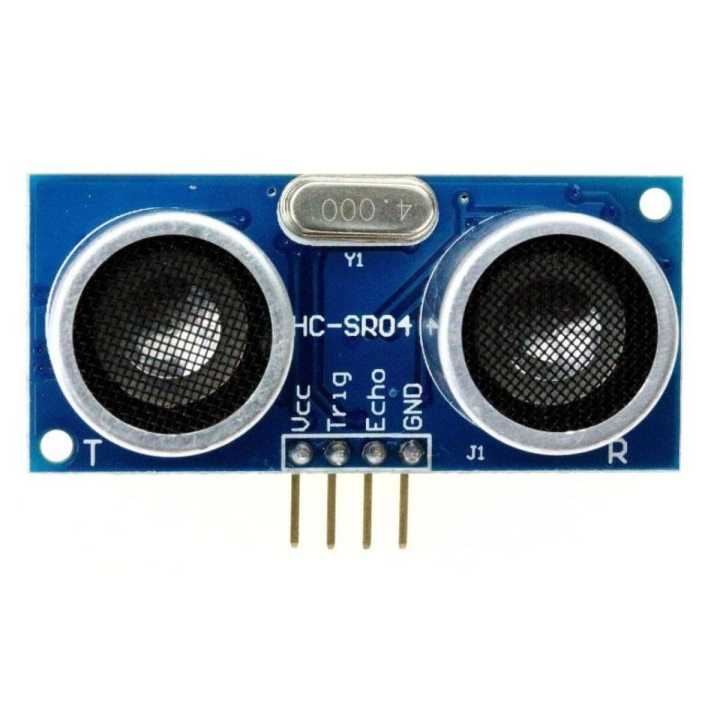
</p>

---

## Pin Configuration

<p align="center">
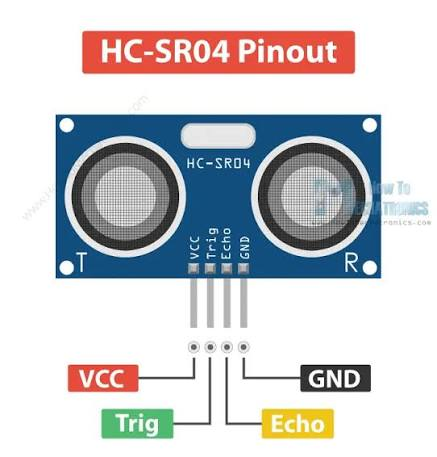
</p>

| Pin | Description |
|------|-------------|
| VCC | +5V |
| TRIG | Trigger Pulse |
| ECHO | Echo Signal |
| GND | Ground |

---

## Background Theory

The HC-SR04 is a non-contact distance measurement sensor that uses ultrasonic sound waves at **40 kHz**. It determines the distance between the sensor and an object by measuring the time taken for the reflected sound wave to return.

### Applications

- Obstacle Detection
- Robotics
- Water Level Monitoring
- Parking Systems
- Distance Measurement
- Smart Vehicles

---

## Features

- Non-Contact Measurement
- High Accuracy
- Long Detection Range
- Low Cost
- Easy Interface

---

## Specifications

| Feature | Value |
|----------|-------|
| Range | 2 cm – 400 cm |
| Accuracy | ±3 mm |
| Operating Voltage | 5V |
| Frequency | 40 kHz |

---

## Working Principle

The HC-SR04 consists of an ultrasonic transmitter and receiver.

Operation sequence:

1. The microcontroller sends a 10 µs pulse to the TRIG pin.
2. The transmitter emits an ultrasonic wave.
3. The wave travels through the air.
4. The wave reflects from an object.
5. The receiver detects the reflected wave.
6. The ECHO pin remains HIGH during the travel time.
7. The microcontroller calculates the distance using:

```text
Distance = (Speed of Sound × Time) / 2
```

The division by two accounts for the round-trip travel of the sound wave.

---

# 5. MQ Gas Sensor (MQ-2)

## Image

<p align="center">
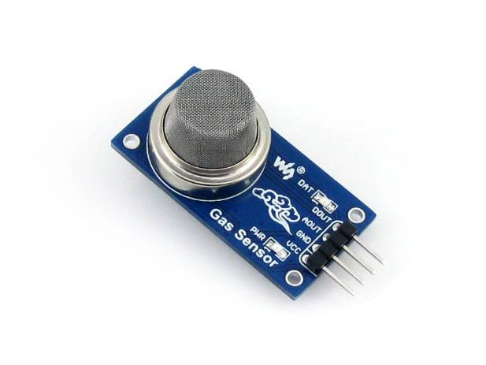
</p>

---

## Pin Configuration

<p align="center">
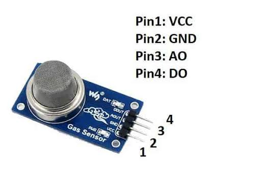
</p>

| Pin | Description |
|------|-------------|
| VCC | Power Supply |
| GND | Ground |
| AO | Analog Output |
| DO | Digital Output |

---

## Background Theory

The MQ-2 gas sensor is widely used for detecting combustible gases and smoke. It is based on a tin dioxide (SnO₂) sensing material whose electrical resistance changes when exposed to various gases.

It can detect:

- LPG
- Propane
- Methane
- Hydrogen
- Smoke
- Butane

### Applications

- Gas Leakage Detection
- Fire Alarm Systems
- Industrial Safety
- Smart Kitchens
- Air Quality Monitoring

---

## Features

- High Sensitivity
- Analog Output
- Digital Output
- Adjustable Threshold
- Long Operating Life
- Low Cost

---

## Specifications

| Feature | Value |
|----------|-------|
| Operating Voltage | 5V |
| Detection Gas | LPG, Smoke, Methane, Hydrogen |
| Output | Analog and Digital |

---

## Working Principle

The sensing element is made of **SnO₂ (Tin Dioxide)**, which has low conductivity in clean air.

When combustible gases are present:

1. Gas molecules react with the sensing surface.
2. Sensor resistance decreases.
3. Output voltage changes.
4. The analog voltage is read by the ADC of the microcontroller.
5. Digital output becomes HIGH or LOW depending on the threshold set using the onboard potentiometer.

The microcontroller processes this information and can activate alarms, exhaust fans, or emergency notification systems.
When powered, the ATmega328P microcontroller executes the uploaded sketch stored in flash memory.
The sketch consists of two main functions:

- **setup()** – Executes once during startup to initialize pins and peripherals.
- **loop()** – Executes continuously to read sensor inputs, process data, and control output devices.

The Arduino repeats this cycle until power is removed, making it suitable for continuous monitoring and control applications.
configurations, features, and detailed working principles** in the same professional GitHub style.
---

# Actuators

Actuators are output devices that convert electrical signals into physical actions such as light, sound, motion, or switching. In an IoT system, actuators receive control signals from a microcontroller and perform actions based on the processed sensor data.

## Importance of Actuators in IoT

Actuators enable IoT systems to interact with the physical environment by:

- Turning electrical signals into physical movement.
- Controlling electrical appliances.
- Producing visual and audible alerts.
- Automating industrial and home applications.
- Improving efficiency and reducing manual intervention.

The general operation of an actuator in an IoT system is shown below.

```text
Sensor Data
      │
      ▼
+-------------------+
| Microcontroller   |
| ESP32 / Arduino   |
+-------------------+
      │
Control Signal
      │
      ▼
+-------------------+
|    Actuator       |
+-------------------+
      │
Physical Action
(Light, Sound,
 Motion, Switching)
```

---

# 1. LED (Light Emitting Diode)

## Image

<p align="center">
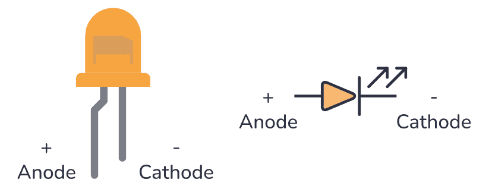
</p>

---

## Pin Configuration

<p align="center">
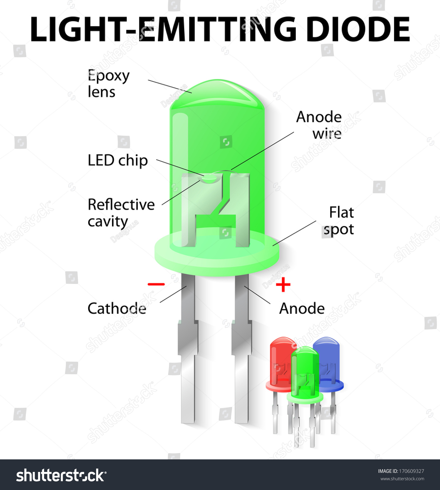
</p>

| Pin | Description |
|------|-------------|
| Anode (+) | Positive Terminal |
| Cathode (-) | Negative Terminal |

---

## Background Theory

A Light Emitting Diode (LED) is a semiconductor device that emits light when electric current flows through it in the forward direction. LEDs are among the most widely used output devices in electronics due to their low power consumption, long lifespan, and high efficiency.

### Applications

- Status Indicators
- Display Panels
- Traffic Lights
- Smart Lighting
- Electronic Circuits

---

## Features

- Low Power Consumption
- High Brightness
- Long Life
- Fast Switching
- Compact Size

---

## Working Principle

When a forward voltage is applied, electrons and holes recombine at the PN junction of the semiconductor material. This recombination releases energy in the form of visible light, a phenomenon known as **electroluminescence**.

The color of the emitted light depends on the semiconductor material used.

---

# 2. Buzzer

## Image

<p align="center">
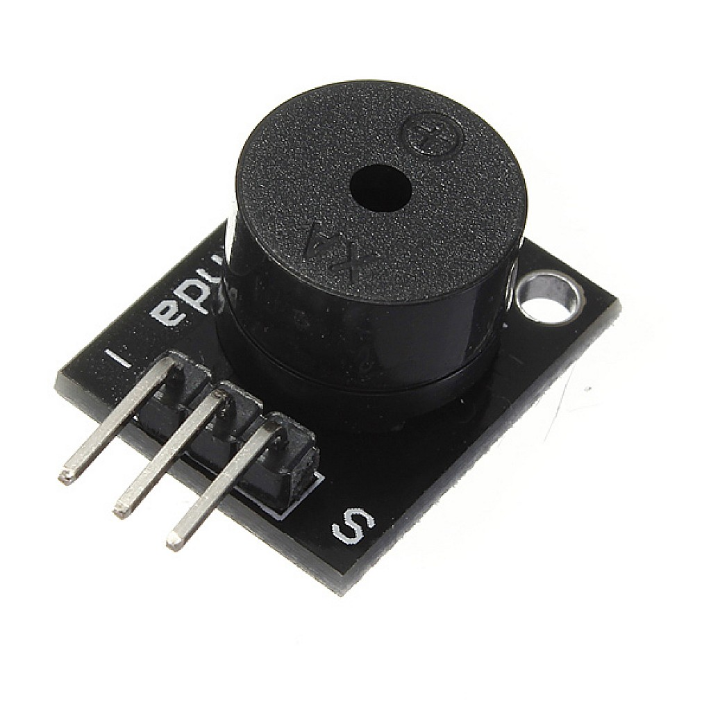
</p>

---

## Pin Configuration

<p align="center">
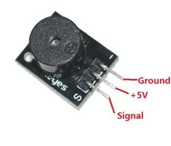
</p>

| Pin | Description |
|------|-------------|
| VCC | Power Supply |
| GND | Ground |
| SIG | Signal Pin |

---

## Background Theory

A buzzer is an electronic audio output device used to generate sound. It is commonly used for alarms, notifications, warning systems, and user feedback in embedded systems.

### Applications

- Fire Alarms
- Burglar Alarms
- Home Automation
- Doorbells
- Notification Systems

---

## Features

- Simple Interface
- Low Power Consumption
- Loud Sound Output
- Long Operating Life

---

## Working Principle

A buzzer converts electrical energy into sound energy.

For a piezoelectric buzzer, an alternating voltage causes a piezoelectric crystal to vibrate rapidly. These vibrations create pressure waves in the air, producing an audible sound.

---

# 3. Servo Motor

## Image

<p align="center">
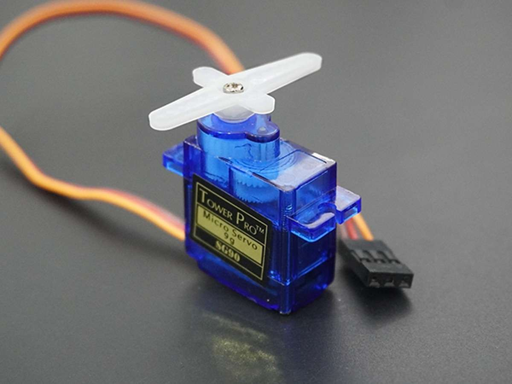
</p>

---

## Pin Configuration

<p align="center">
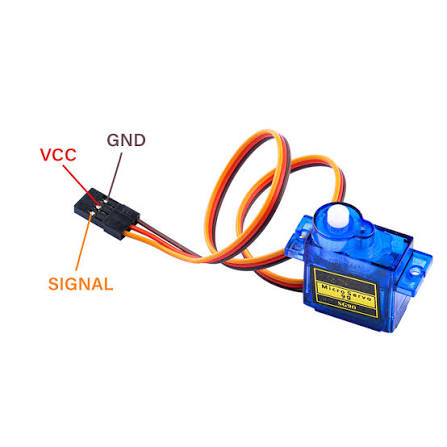
</p>

| Wire | Description |
|-------|-------------|
| Brown/Black | Ground |
| Red | VCC |
| Orange/Yellow | PWM Signal |

---

## Background Theory

A servo motor is a rotary actuator that provides precise control of angular position. Unlike a standard DC motor, a servo motor uses a feedback mechanism to accurately position its shaft.

Servo motors are widely used in robotics, automation, and remote-controlled systems.

### Applications

- Robotics
- Robotic Arms
- Automatic Doors
- Camera Positioning
- CNC Machines

---

## Features

- Accurate Position Control
- High Torque
- PWM Controlled
- Built-in Feedback Mechanism

---

## Working Principle

A servo motor consists of:

- DC Motor
- Gearbox
- Position Sensor (Potentiometer)
- Control Circuit

The microcontroller sends PWM (Pulse Width Modulation) signals to the servo.

The internal controller compares the desired position with the actual position and rotates the motor until both positions match. This closed-loop control system provides high positional accuracy.

---

# 4. DC Motor

## Image

<p align="center">
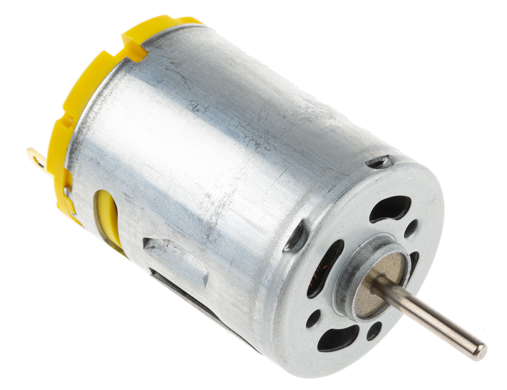
</p>

---

## Background Theory

A DC motor converts electrical energy into mechanical rotational energy. It is one of the most commonly used actuators in embedded systems due to its simplicity and high efficiency.

### Applications

- Electric Vehicles
- Fans
- Pumps
- Robotics
- Conveyor Systems

---

## Features

- Continuous Rotation
- High Speed
- Easy Speed Control
- Bidirectional Rotation

---

## Working Principle

When electric current flows through the armature winding, it generates a magnetic field.

The interaction between this magnetic field and the permanent magnets produces rotational torque, causing the shaft to rotate.

Reversing the polarity of the applied voltage changes the direction of rotation.

---

# 5. Relay Module

## Image

<p align="center">
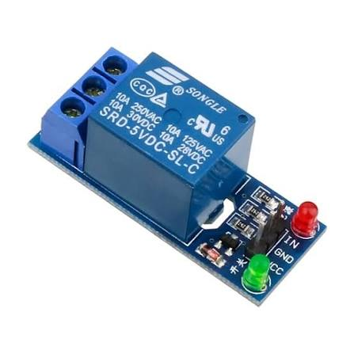
</p>

---

## Pin Configuration

<p align="center">
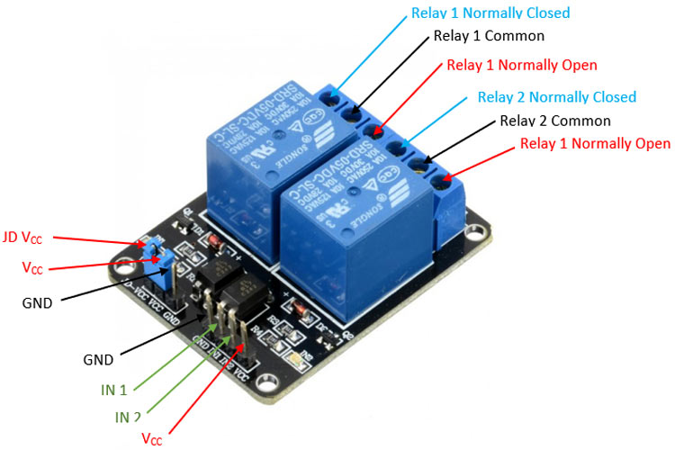
</p>

### Control Side

| Pin | Description |
|------|-------------|
| VCC | Power Supply |
| GND | Ground |
| IN | Control Signal |

### Relay Contacts

| Terminal | Description |
|-----------|-------------|
| COM | Common |
| NO | Normally Open |
| NC | Normally Closed |

---

## Background Theory

A relay is an electrically operated switch that allows a low-voltage microcontroller to safely control high-voltage or high-current electrical devices. It provides electrical isolation between the control circuit and the load.

### Applications

- Home Automation
- Industrial Automation
- Smart Switches
- Motor Control
- Lighting Systems

---

## Features

- Electrical Isolation
- High Current Switching
- Low Power Control
- Reliable Operation

---

## Working Principle

A relay contains an electromagnetic coil and movable switch contacts.

1. A control signal energizes the coil.
2. The coil produces a magnetic field.
3. The magnetic field pulls the armature.
4. The contacts change state (NO ↔ COM or NC ↔ COM).
5. The connected electrical appliance turns ON or OFF.

This allows microcontrollers operating at 3.3 V or 5 V to safely control high-voltage AC loads.

---

# Procedure

1. Study the architecture of an embedded system and identify its major components.
2. Observe the Raspberry Pi, ESP32, ESP8266, and Arduino Uno development boards.
3. Identify the GPIO pin configuration and power pins of each board.
4. Compare the specifications and communication interfaces of all microcontrollers.
5. Examine the construction and pin configuration of the DHT11/DHT22, LDR, Soil Moisture Sensor, HC-SR04, and MQ Gas Sensor.
6. Understand the operating principles of each sensor and their practical applications.
7. Study the construction, pin configuration, and applications of LEDs, Buzzers, Servo Motors, DC Motors, and Relay Modules.
8. Interface selected sensors and actuators with a suitable development board.
9. Observe the sensor readings and actuator responses during operation.
10. Record observations and compare the characteristics of different embedded platforms and peripheral devices.

---

# Conclusion

This experiment provided a comprehensive understanding of embedded systems and their importance in Internet of Things (IoT) applications. The architecture of embedded systems and the roles of microcontrollers, sensors, and actuators were studied in detail.

The features, specifications, GPIO pin configurations, and working principles of the Raspberry Pi, ESP32, ESP8266, and Arduino Uno were examined to understand their capabilities and suitable application areas.

Various sensors, including the DHT11/DHT22, Light Sensor (LDR), Soil Moisture Sensor, Ultrasonic Sensor (HC-SR04), and MQ Gas Sensor, were explored to understand how physical parameters are converted into electrical signals for processing by embedded systems.

Similarly, actuators such as LEDs, Buzzers, Servo Motors, DC Motors, and Relay Modules were studied to understand how electrical control signals are converted into physical actions.

Overall, this experiment established a strong foundation in embedded systems, sensor interfacing, actuator control, and IoT hardware platforms, preparing students for the design and implementation of real-world IoT applications.

---


